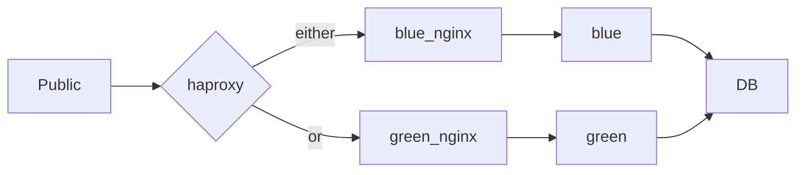

# Blue/Green deployment example for Laravel framework

## Pay attention
This setup uses hardcoded docker network IP range and IPs for services.
This may cause a problem if your docker already has this range assigned for other network.
Replace range and IPs in `docker-compose.yml` and all service configuration files to fix the problem.

## How to run
1. Clone your laravel app git repo into `releases/blue` and `releases/green` folders
1. Run one color with: `> docker compose up gateway mysql green green_nginx`

## How to deploy a new release
1. Use `> bash scripts/deploy.sh` script to release a new version. Old version will be turned off.

## How to rollback to previous version/previous color
1. Use `> bash scripts/rollback.sh` script to rollback to previous version (previous color). Rollbacked version will be turned off.

## Stack

1. HAProxy - publicly available gateway and load balanced between blue and green versions
2. ngix for each color - statis serving and proxy for php-fpm
3. `blue` and `green` - colored versions of laravel app
4. mysql - relational database management system. Independent service, both colors use it.

